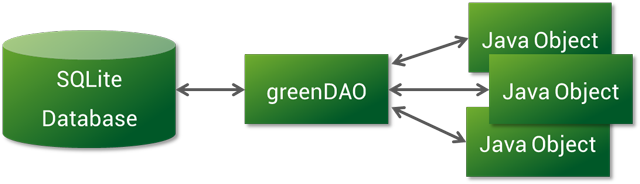
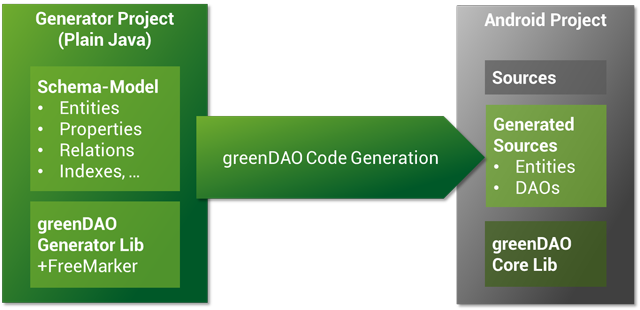
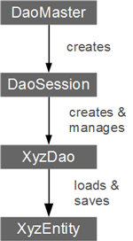

greenDAO是一个针对Android的对象关系映射(ORM)工具.它向SQLite数据库提供了一个对象导向的接口.像greenDao这样的ORM工具不仅为你省去了很多的重复工作，而且提供了更简便的操作接口.

## DAO代码生成工程

为了在你的Android项目中(通常是Eclipse项目)使用greenDao，你还需要第二个项目，就是"生成器"(`generator project`).生成器的任务就是生成指定项目的domain.`generator project`是一个普通的Java项目(不是Android项目).确保代码生成器(`greenDAO-generator.jar`)和Freemarker(`freemarker.jar`)已经在classpath中进行了设置.然后创建一个可执行的Java类,构建你的实体模型并且使用代码生成器生成相关代码.关于更多细节,请查看[modelling documentation](http://greenrobot.org/documentation/modelling-entities/)    
    
## 核心类

在你生成了需要的代码后,就可以开始在Android工程中使用greenDAO.不要忘记将greenDAO核心库(`greenDAO.jar`)添加到你的Android工程中.

以下核心类是greenDAO的基本接口:

**DaoMaster:**是使用greenDAO的入口.DaoMaster按照特定的约束持有数据库对象(`SQLiteDatabase`)并且管理一些DAO类(不是对象).它拥有创建和删除表的静态方法.它的内部类`OpenHelper`和`DevOpenHelper`用于创建SQLite数据库的约束,是`SQLiteOpenHelper`的实现类.

**DaoSession:**用于管理所有可用遵循特定约束的DAO对象,你可以通过特定的`getter`方法来获取一个DaoSession.DaoSession提供了一些针对实体的泛型方法,像insert,load,update,refresh和delete.最后,DaoSession对象也会对Identity Scope进行跟踪.更多细节,请查看[session documentation](http://greenrobot.org/documentation/sessions/).

**DAOs:**数据访问对象(Data access objects,DAOs)能够持久化和查询对应的实体.对每一个实体,greenDAO都生成一个DAO.它比DaoSession拥有更多的持久化方法,例如:`count`,`loadAll`和`insertInTx`.

**Entities:**可持久化的对象.通常来说,Entities使用生成工具进行生成(不是必须的),并且这些对象使用了标准的Java属性(像POJO或JavaBean)来代表数据库中的一行数据.

## 核心的初始化代码
以下示例代码介绍了如何对数据库和核心的greenDAO类进行初始化:

```java
helper = new DaoMaster.DevOpenHelper(this, "notes-db", null);
db = helper.getWritableDatabase();
daoMaster = new DaoMaster(db);
daoSession = daoMaster.newSession();
noteDao = daoSession.getNoteDao();
```
示例代码中假定有一个"Note"实体.通过它的DAO,我们可以对它进行持久化操作.

---
原文链接:[http://greenrobot.org/greendao/documentation/introduction/](http://greenrobot.org/greendao/documentation/introduction/)